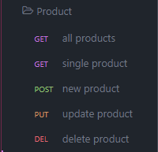

# E-Commerce Back End

## Description
An e-commerce back-end API built with MySQL and Express.js. The database has tables for categories, products and tags, then joins products and tags through an intermediate table.

## Index

- [Installation](#installation)
- [Usage](#usage)
- [Insomnia Routes](#insomnia-routes)
    - [Categories](#categories)
    - [Products](#products)
    - [Tags](#tags)
- [License](#license)
- [Built With](#built-with)

## Installation
[^](#index)

Clone the repository

    git clone git@github.com:scottrohrig/e-commerce-back-end.git

Install the necessary dependencies

    npm i

## Usage
[^](#index)

First you must create the database.

Run the MySQL Shell from the terminal. Then type in your MySQL root password.

    mysql -u root -p

After loggin into the shell, source the database.

    source db/schema.sql

Create a .env file in the root directory of the repository

    touch .env

Add the following environmental variables to the .env file and change your user and PW to your MySQL user and password

    DB_NAME='ecommerce_db'
    DB_USER='root'
    DB_PW='password1234'

Save the .env file and run the seed command

    npm run seed

Now you are ready to start the server

    npm start

## Insomnia Routes
[^](#index)

To test the routes using insomnia, create folders for categories, products and tags.

### Categories
[^^](#insomnia-routes)

Make the insomnia routes for Categories

click to view insomnia routes

GET route for all categores

    localhost:3001/api/categories

GET route for category by id

    localhost:3001/api/categories/:id

POST route to create a new category

    localhost:3001/api/categories

Then add the body

      {
          "category_name": "pants"
      }

PUT route to update a category name

    localhost:3001/api/categories/:id

Then add the body

      {
          "category_name": "leggings"
      }

DELETE route to remove category by id

    localhost:3001/api/categories/:id

### Products
[^^](#insomnia-routes)

Make the insomnia routes for Products

click to view insomnia routes

GET route for all products

    localhost:3001/api/products

GET route for product by id

    localhost:3001/api/products/:id

POST route to create a new product

    localhost:3001/api/products

Then add the body of the new product

    {
        "product_name": "dockers",
        "price": 24,
        "stock": 8,
        "tagIds": [3,4,5,6,7],
        "category_id": 7
    }

PUT route to update a products tags

    localhost:3001/api/products/:id

Then add the body with the updated tag ids

    {
        "tagIds": [ 3,4,5,6,7 ]
    }

DELETE route to remove product by id

    localhost:3001/api/products/:id

### Tags
[^^](#insomnia-routes)

Make the insomnia routes for tags

click to view insomnia routes

GET route for all tags

    localhost:3001/api/tags

GET route for tag by id

    localhost:3001/api/tags/:id

POST route to create a new tag

    localhost:3001/api/tags

Then add the body of the new tag

    {
        "tag_name": "chartreuse"
    }

PUT route to update a tag name

    localhost:3001/api/tags/:id

Then add the body with the updated tag ids

    {
        "tag_name": "teal"
    }

DELETE route to remove tag by id

    localhost:3001/api/tags/:id

## License
[^](#index)

## Built With
[^](#index)

## Questions

Feel free to contact me using the information below!

- GitHub Profile: [@scottrohrig](https://github.com/scottrohrig)

- Email: scott.rohrig@gmail.com

- Project Repository/URL: [github.com/.../e-commerce-back-end](https://github.com/scottrohrig/e-commerce-back-end)
